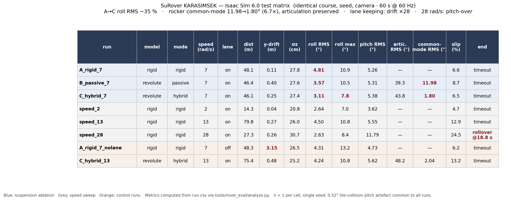

# Test Matrix — Results (24 Aug 2026, Isaac Sim 6.0.1.0)




Eight runs on an identical procedural Mars-analogue course (same seed, same camera, same physics config).
Each folder contains `run.csv` (60 Hz telemetry, 20 columns), `config.json`, `log.txt`, `video.mp4` (60 s real-time, Git LFS).
Metrics: `metrics.csv` / `metrics.md` (generated by `tools/rover_eval/analyze.py`).

## Design

| Axis | Runs | Variable | Constant |
|---|---|---|---|
| 1 — Suspension ablation | `A_rigid_7` → `B_passive_7` → `C_hybrid_7` | rocker: locked → free+damped → free+damped+PD | 7 rad/s, lane on |
| 2 — Speed sweep (rigid) | `speed_2`, `A_rigid_7`, `speed_13`, `speed_28` | 2 / 7 / 13 / 28 rad/s (0.29 / 1.0 / 1.9 / 4.1 m/s) | rigid, lane on |
| Control | `A_rigid_7_nolane` | lane keeping off | vs `A_rigid_7` |
| Control | `C_hybrid_13` | hybrid at 13 rad/s | vs `speed_13` (rigid) and `C_hybrid_7` |

`A_rigid_7` anchors both axes. Passive and hybrid share rocker damping (300); hybrid adds only the PD common-mode torque (KP 300, KD 70, τmax 60 N·m).

## Results

| run | model | mode | speed | lane | dist (m) | y-drift (m) | σz (cm) | roll RMS (°) | roll max (°) | pitch RMS (°) | artic RMS (°) | common-mode RMS (°) | slip (%) | end |
|---|---|---|---|---|---|---|---|---|---|---|---|---|---|---|
| A_rigid_7 | rigid | rigid | 7 | on | 48.1 | 0.11 | 27.8 | **4.81** | 10.9 | 5.26 | — | — | 6.6 | timeout |
| B_passive_7 | revolute | passive | 7 | on | 46.4 | 0.40 | 27.6 | **3.57** | 10.5 | 5.31 | 39.3 | **11.98** | 8.7 | timeout |
| C_hybrid_7 | revolute | hybrid | 7 | on | 46.1 | 0.25 | 27.4 | **3.11** | **7.8** | 5.38 | 43.8 | **1.80** | 6.5 | timeout |
| speed_2 | rigid | rigid | 2 | on | 14.3 | 0.04 | 20.8 | 2.64 | 7.0 | 3.62 | — | — | 4.7 | timeout |
| speed_13 | rigid | rigid | 13 | on | 79.8 | 0.27 | 26.0 | 4.50 | 10.8 | 5.55 | — | — | 12.9 | timeout |
| speed_28 | rigid | rigid | 28 | on | 27.3 | 0.26 | 30.7 | 2.63 | 8.4 | 11.79 | — | — | 24.5 | **rollover @ 18.8 s** |
| A_rigid_7_nolane | rigid | rigid | 7 | off | 48.3 | **3.15** | 26.5 | 4.31 | 13.2 | 4.73 | — | — | 6.2 | timeout |
| C_hybrid_13 | revolute | hybrid | 13 | on | 75.4 | 0.48 | 25.2 | 4.24 | 10.8 | 5.62 | 48.2 | 2.04 | 13.2 | timeout |

## Findings

**Suspension ablation (A → B → C).** Roll RMS decreases monotonically: 4.81 → 3.57 → 3.11° (−26 % passive, **−35 % hybrid** vs rigid); peak roll 10.9 → 7.8°. Pitch RMS is unchanged (~5.3°) across the three, i.e. the mechanism acts on the intended axis only.

**Controller mechanism.** The hybrid PD reduces rocker common-mode RMS from 11.98° to 1.80° (**6.7× suppression**) while differential articulation is preserved (39 → 44°). Torque saturation 0 %. This is the direct evidence for the stated goal: *suppress common-mode rocker motion, preserve anti-phase articulation*. The B→C roll gain (−13 %) is smaller than the A→B gain and should be argued from common-mode suppression, not roll alone (single seed).

**Speed sweep (rigid).** Slip grows 4.7 → 6.6 → 12.9 → 24.5 % with speed. At 28 rad/s (4.1 m/s) the rover **pitches over** (pitch max 60.6°) on the ridge section at 18.8 s — failure is a pitch/nose-in event, not a roll event. Stability limit lies between 13 and 28 rad/s.

**Lane keeping.** Disabling the steering correction raises lateral drift from 0.11 m to 3.15 m over 48 m (**28×**).

**Hybrid at speed.** At 13 rad/s the controller still holds common-mode at 2.04° (vs 1.80° at 7 rad/s); roll RMS 4.24° vs rigid 4.50° at the same speed.

## Limitations (state these in any write-up)

- **n = 1 per cell, single terrain seed.** Repeat with ≥3 seeds before quoting ±.
- **Tile-collision artefact:** residual pitch noise 0.52° (flat-plane baseline 0.06°). Common to all runs; supports relative comparison, not absolute σz/pitch.
- **Rocker hard-stop:** |q| reaches the ±0.5 rad joint limit on ridges in both B and C. Controller benefit is bounded by joint travel (design input for mechanical team).
- URDF velocity/effort values are placeholders; 7 rad/s is the nominated nominal, 28 rad/s a stress point.
- Rocker spring/damper architecture unverified; damping = 300 is a modelling assumption.
- No hardware validation yet (planned: Jetson Orin deployment, October).

## Reproduce

```bash
cd /workspace && nohup bash sim/isaac/run_matrix.sh > matrix_log.txt 2>&1 &
python tools/rover_eval/analyze.py
```
